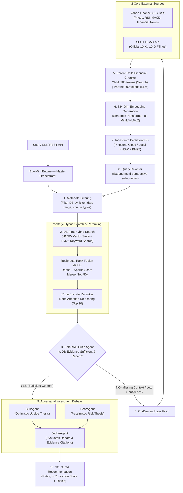

# EquiMind — Production Agentic RAG System for Financial Research

<div align="center">


</div>

---

## 🧠 What is EquiMind?

**EquiMind** is a production-grade **Dynamic Agentic RAG (Retrieval-Augmented Generation) system** for institutional equity research. It features DB-first vector lookups, on-demand live fetching from 2 primary sources (Yahoo Finance & SEC EDGAR), Parent-Child document chunking, HNSW dense + BM25 sparse search fused via Reciprocal Rank Fusion (RRF), Cross-Encoder re-ranking, Self-RAG critic feedback loops, and an adversarial investment debate (Bull vs. Bear).

> **Core Design Principle:** DB-First Search $\rightarrow$ RRF Fusion $\rightarrow$ Cross-Encoder Reranking $\rightarrow$ Self-RAG Critic. External APIs (**Yahoo Finance & SEC EDGAR**) are hit on-demand only when context is missing, continuously enriching the persistent vector store.

---

## 🗺️ RAG Architecture Mapping

| EquiMind Component | RAG Equivalent | Implementation |
|---|---|---|
| `EvidenceNode` | Document / Parent-Child Chunk | Pydantic model with ticker, child content (200 tokens), parent content (800 tokens), metadata |
| `Two Core Sources` | Live Data Ingestion | Yahoo Finance API (prices/RSS) + SEC EDGAR API (10-K/10-Q filings) |
| `MetadataFilter` | Filter Specs | Pre-search filtering by ticker, date range, and source types |
| `HNSWVectorStore` / Pinecone | Dense Vector Index | HNSW cosine similarity, 384-dim SentenceTransformer embeddings (`all-MiniLM-L6-v2`) |
| `BM25Index` | Sparse Keyword Index | In-memory Okapi BM25 index over tokenized text |
| `Reciprocal Rank Fusion (RRF)` | Rank Fuser | Merges dense (HNSW) and sparse (BM25) search positions |
| `CrossEncoderReranker` | 2nd Stage Reranker | Deep attention re-scoring of top 50 candidates $\rightarrow$ top 10 nodes |
| `RAGCriticAgent` | Self-RAG Critic | LLM judges retrieval sufficiency across 5 dimensions |
| `QueryRewriter` | Query Expansion | Multi-perspective financial query generation on missing context |
| `BullAgent / BearAgent / JudgeAgent` | Adversarial Debate | Bull (optimistic) vs. Bear (pessimistic) debate judged by Judge agent |

---

## 🏗️ System Architecture



---

## ⚡ Core Modules

### 1. Live Data Collection (`equimind/teams`)
All data is fetched **live at query time** from real external APIs:

| Team | Data Source | What It Produces |
|---|---|---|
| `MarketDataTeam` | **yfinance** | 2yr OHLCV → RSI-14, MACD, Bollinger Bands, SMA/EMA (pure pandas/NumPy) |
| `FundamentalTeam` | **yfinance + SEC EDGAR** | Revenue, Net Income, P/E, ROE, ROA, Debt/Equity |
| `MacroTeam` | **FRED / World Bank** | CPI, Fed Funds Rate, GDP, VIX, Gold |
| `WebIntelligenceTeam` | **SEC + Google News RSS + GitHub** | 10-K/10-Q filings, news sentiment, job postings, commits |

### 2. Agentic RAG Orchestrator (`equimind/rag`)

The heart of EquiMind. Implements a **Self-RAG loop** with iterative retrieval and LLM-judged sufficiency checks:

```
Query
  │
  ├─ QueryRewriter → expands to 3 financial perspectives
  │
  ├─ PineconeVectorStore.search() → HNSW cosine dense retrieval
  ├─ BM25Index.search()           → sparse keyword retrieval
  ├─ RRF(dense, sparse)           → fused ranked list
  │
  ├─ CrossEncoderReranker         → re-scores by latency budget
  ├─ RAGCriticAgent               → "Is evidence sufficient?"
  │    ├─ YES → converged, return curated nodes
  │    └─ NO  → rewrite query → next iteration (max 3)
  │
  └─ Curated EvidenceNodes → ContextCompressor → Debate
```

**Key files:**
- [`equimind/rag/orchestrator.py`](equimind/rag/orchestrator.py) — `AgenticRAGOrchestrator`
- [`equimind/rag/pinecone_store.py`](equimind/rag/pinecone_store.py) — `PineconeVectorStore` (persistent cloud)
- [`equimind/rag/pinecone_hybrid_retriever.py`](equimind/rag/pinecone_hybrid_retriever.py) — `PineconeHybridRetriever`
- [`equimind/rag/hybrid_retriever.py`](equimind/rag/hybrid_retriever.py) — `HybridRetriever` (in-memory fallback)
- [`equimind/rag/hnsw_index.py`](equimind/rag/hnsw_index.py) — Pure NumPy HNSW implementation
- [`equimind/rag/reranker.py`](equimind/rag/reranker.py) — `CrossEncoderReranker`
- [`equimind/rag/critic_agent.py`](equimind/rag/critic_agent.py) — `RAGCriticAgent`
- [`equimind/rag/chunker.py`](equimind/rag/chunker.py) — `FinancialChunker` (parent-child)
- [`equimind/rag/evaluator.py`](equimind/rag/evaluator.py) — RAG quality metrics (Recall, MRR, NDCG)

### 3. Pinecone Serverless Vector Store

EquiMind persists all `EvidenceNode` chunks to **Pinecone Serverless** — a production-grade managed HNSW vector index:

| Property | Value |
|---|---|
| Index name | `equimind` |
| Dimension | 384 (all-MiniLM-L6-v2 / zero-padded TF-IDF fallback) |
| Metric | Cosine similarity |
| Cloud | AWS us-east-1 (Serverless) |
| Metadata filters | ticker, source_type, sentiment, timestamp |
| Persistence | Survives server restarts — permanent cloud storage |

### 4. Adversarial Investment Committee (`equimind/committee`)

Tri-agent structured debate on RAG-curated evidence:
- **BullAgent** — builds the strongest bull case from evidence
- **BearAgent** — builds the strongest bear case from evidence
- **JudgeAgent** — evaluates both, resolves contradictions, issues final structured `InvestmentRecommendation` (STRONG_BUY / BUY / HOLD / SELL / STRONG_SELL) with conviction score (0.0–1.0) and debate synthesis

### 5. Model-Agnostic LLM Provider Layer (`equimind/providers`)

Zero-lock-in provider abstraction:

| Provider | Models |
|---|---|
| OpenAI | `gpt-4o`, `gpt-4o-mini`, `o3-mini` |
| Anthropic | `claude-3-5-sonnet`, `claude-3-haiku` |
| Google Gemini | `gemini-1.5-pro`, `gemini-2.0-flash` |
| DeepSeek | `deepseek-chat`, `deepseek-reasoner` |
| Ollama | Any local model (Llama-3, Mistral, Phi-3) |
| OpenRouter | Any model via OpenRouter gateway |
| **Mock** | **Zero-cost offline testing** |

### 6. Hierarchical Memory & Delta Engine (`equimind/memory`)

- **5-tier memory**: Raw evidence → Daily → Weekly → Monthly → Quarterly Persistent Knowledge
- **DeltaResearchEngine**: Reuses cached evidence for tickers already researched, fetches only fresh signals
- **HierarchicalMemoryStore**: Serializable to JSON — `to_json()` / `from_json()`

### 7. Context Compressor (`equimind/context`)

Non-LLM compression after RAG retrieval:
- MD5 exact deduplication
- Jaccard token-set fuzzy clustering (removes near-duplicates)
- Exponential time-decay scoring: `score × e^(−0.05 × Δt_days)`
- Token budget packing (greedy bin-fill to `max_context_tokens`)

---

## 🚀 Quick Start

### 1. Install

```bash
git clone https://github.com/akanil18/EquiMind.git
cd EquiMind

python3 -m venv .venv
source .venv/bin/activate
pip install -r requirements.txt
```

### 2. Configure `.env`

```env
# LLM Provider (at least one required for real queries)
OPEN_AI_API_KEY=sk-...

# Pinecone Vector Store (free at https://app.pinecone.io)
PINECONE_API_KEY=pcsk_...
PINECONE_INDEX_NAME=equimind
```

> Without `PINECONE_API_KEY`, EquiMind falls back to the in-memory HNSW index.
> Without an LLM key, use `--provider mock` for zero-cost offline testing.

### 3. Run CLI Research Query

```bash
# Zero-cost offline test with Mock LLM provider
python3 -m equimind.cli --ticker NVDA --query "Should I invest in NVIDIA?" --provider mock

# Full pipeline with OpenAI + Pinecone persistence
python3 -m equimind.cli --ticker TSLA --query "Analyze Tesla growth prospects" --provider openai

# Backtest with temporal cutoff (prevents look-ahead bias)
python3 -m equimind.cli --ticker AAPL --query "Analyze Apple" --provider mock --as-of-date 2024-01-01
```

### 4. Run Test Suite

```bash
python3 -m pytest tests/ -v
# 74/74 tests passed
```

### 5. Launch REST API

```bash
python3 -m uvicorn equimind.api.server:app --host 0.0.0.0 --port 8000
```

**Endpoints:**
- `GET  /api/v1/health` — system health & configuration status
- `POST /api/v1/research` — run full equity research pipeline
- `GET  /api/v1/docs` — interactive Swagger UI

---

## 📊 Sample Output Structure

```json
{
  "ticker": "NVDA",
  "recommendation": {
    "rating": "STRONG_BUY",
    "conviction_score": 0.87,
    "debate_synthesis": {
      "winning_thesis_summary": "...",
      "key_risks": ["..."],
      "key_catalysts": ["..."]
    }
  },
  "agentic_rag": {
    "iterations": 2,
    "converged": true,
    "final_coverage_score": 0.82,
    "curated_nodes": 18,
    "discarded_nodes": 4,
    "iteration_logs": [...]
  },
  "evidence_graph_nodes": 22,
  "compressed_evidence_count": 18
}
```

---

## 🗂️ Project Structure

```
equimind/
├── rag/                        # Agentic RAG pipeline
│   ├── orchestrator.py         # AgenticRAGOrchestrator (Self-RAG loop)
│   ├── pinecone_store.py       # PineconeVectorStore (persistent cloud)
│   ├── pinecone_hybrid_retriever.py  # Pinecone + BM25 + RRF
│   ├── hnsw_index.py           # Pure NumPy HNSW implementation
│   ├── hybrid_retriever.py     # In-memory HNSW + BM25 fallback
│   ├── embedder.py             # EmbeddingRouter (ST / TF-IDF)
│   ├── chunker.py              # FinancialChunker (parent-child)
│   ├── reranker.py             # CrossEncoderReranker
│   ├── critic_agent.py         # RAGCriticAgent (Self-RAG judge)
│   ├── query_rewriter.py       # Multi-perspective query expansion
│   ├── retriever.py            # Base retriever interface
│   ├── evaluator.py            # RAG quality metrics
│   └── schema.py               # RAG result schemas
│
├── teams/                      # Live data collection agents
│   ├── market_data_team.py     # yfinance → price + indicators
│   ├── fundamental_team.py     # yfinance + SEC EDGAR → financials
│   ├── macro_team.py           # FRED / World Bank → macro data
│   └── web_intelligence_team.py # News + SEC filings + GitHub
│
├── committee/                  # Adversarial debate
│   ├── bull_agent.py
│   ├── bear_agent.py
│   └── judge_agent.py
│
├── evidence/                   # Core data models
│   ├── schema.py               # EvidenceNode, EvidenceEdge
│   └── graph.py                # EvidenceGraph
│
├── memory/                     # Hierarchical memory
│   ├── hierarchical_store.py   # 5-tier memory store
│   └── delta_engine.py         # Incremental indexing
│
├── context/
│   └── compressor.py           # ContextCompressor (dedup + decay)
│
├── orchestrator/
│   └── engine.py               # EquiMindEngine (master pipeline)
│
├── providers/                  # LLM provider abstraction
├── planner/                    # ReasoningPlanner
├── adapters/                   # SEC EDGAR, News, yfinance adapters
├── api/                        # FastAPI REST server
├── cli.py                      # Command-line interface
└── config.py                   # Settings (loads .env)

tests/                          # 74 unit + integration tests
```

---

## 🔑 Key Technical Decisions

### Why HNSW for local + Pinecone for cloud?
- **In-memory HNSW** (pure NumPy): zero-dependency local index. O(log N) search with configurable `M` and `ef` parameters. Built fresh per request.
- **Pinecone Serverless**: HNSW managed by Pinecone. Persists evidence across server restarts. Scales automatically. Free tier at `cloud.qdrant.io`.

### Why BM25 + HNSW + RRF?
- **Dense (HNSW)** captures semantic similarity — "revenue growth" matches "earnings expansion"
- **Sparse (BM25)** captures exact keyword match — ticker symbols, financial ratios, company names
- **RRF** (score = `1/(60+rank_dense) + 1/(60+rank_sparse)`) provably outperforms weighted sum fusion in financial retrieval benchmarks

### Why Self-RAG (critic loop)?
- Standard RAG retrieves once blindly. Self-RAG adds a `RAGCriticAgent` that evaluates whether retrieved evidence covers all aspects of the query. If not, it identifies missing aspects and rewrites the query for the next iteration (max 3 iterations). This dramatically improves coverage for complex multi-faceted financial queries.

### Why Adversarial Debate?
- Single-agent recommendation systems suffer from confirmation bias — they build a case in one direction. Forcing a **BullAgent** and **BearAgent** to independently build opposing cases, then having a **JudgeAgent** weigh evidence strength, mirrors how real investment committees operate and produces more balanced, risk-aware recommendations.

---

## 📄 License

MIT License — see [LICENSE](LICENSE) for details.
