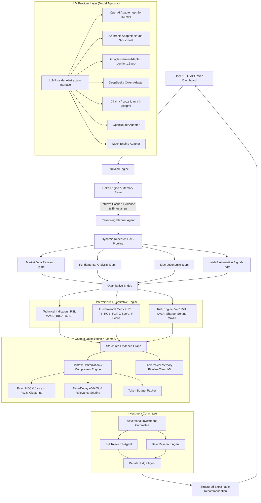

# EquiMind v1.0 System Architecture & Layer Design

EquiMind v1.0 is designed as a model-agnostic, deterministic-quantitative, multi-agent financial research orchestration framework. Rather than acting as a simple prediction bot that outputs unbacked "Buy" or "Sell" ratings, EquiMind operates like an institutional investment committee and quantitative research firm.

---

## 🏛️ System Architecture Diagram (v1.0)

---

## 🔬 Layer Responsibilities (v1.0)

### 1. Model-Agnostic LLM Provider Layer (`equimind.providers`)
Standardizes interactions across OpenAI, Anthropic, Gemini, DeepSeek, Qwen, Ollama, OpenRouter, and MockProvider with automated fallback chains (`ProviderFactory.generate_with_fallback`).

### 2. Dynamic Reasoning Planner Layer (`equimind.planner`)
Formulates sector-tailored research DAGs (`SEMICONDUCTOR_TECH`, `BANKING_FINANCE`, `SAAS_SOFTWARE`, etc.) to execute relevant subagent teams and skip irrelevant scrapers.

### 3. Specialized Research Teams & Adapters (`equimind.teams`)
- `MarketDataTeam`: Prices, volume, liquidity, technical indicators.
- `FundamentalTeam`: Financial statements, balance sheet ratios, Piotroski F-Score (0-9), Altman Z-Score.
- `MacroTeam`: CPI, interest rates, GDP, Brent crude oil, Gold, VIX, FX rates.
- `WebIntelligenceTeam`: SEC filings 10-K/10-Q, Bloomberg news, Reddit r/stocks, Twitter/X analyst feeds, GitHub commits, Earnings transcripts.

### 4. Deterministic Quantitative Engine (`equimind.quantitative`)
Pure mathematical calculators (`numpy`/`pandas`). Zero LLM involvement in numerical computations.

### 5. Evidence Graph & Context Compressor (`equimind.evidence`, `equimind.context`)
Provenance node tracking (`EvidenceNode`), relational edges, MD5 exact deduplication, Jaccard fuzzy clustering, $e^{-0.05 \Delta t}$ time-decay scoring, and token budget packing.

### 6. Adversarial Investment Committee (`equimind.committee`)
Tri-agent debate (`BullAgent` vs `BearAgent` vs `JudgeAgent`) returning ratings (`STRONG_BUY`, `BUY`, `HOLD`, `SELL`), conviction scores, entry target ranges, and provenance citations.

### 7. Hierarchical Memory & Delta Engine (`equimind.memory`)
Tiers 1-5 multi-stage store and `DeltaResearchEngine` timestamp diffing.

### 8. Self-Reflection & Multi-Domain Adapters (`equimind.reflection`, `equimind.domain_adapter`)
`SelfReflectionAgent` bias detection, conviction calibration, and domain adapters for Legal Case Research, Healthcare Review, and Cybersecurity Threat Intel.
